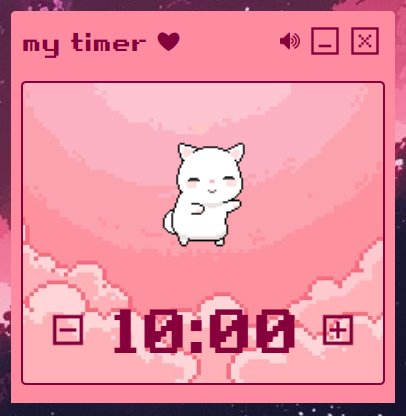
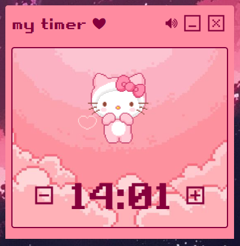

# mytimer — a cute productivity timer ✿

**mytimer** is a dreamy, pastel pink & white-themed desktop app made with 💻 Electron to help you stay productive — with a built-in timer, dancing GIFs, music, and adorable controls.

## 🌸 Tech Stack & Features

**Electron for desktop app framework HTML/CSS/JS for UI and logic.**
- Soft pink + white UI. Built to feel aesthetic and calm
- Customizable countdown timer
- Background music toggle
- Random dancing GIFs for motivation
- Frameless floating window with drag support

## ScreenShots
<p align="center">
  
  
  
</p>

---

## 🛠Installation
> This app runs on Windows (x64) — you can build for Mac/Linux by changing the platform in the build command. 
> If you want to run the app on your device (recommended for developers or curious users):

### 1. Clone the repository

```bash
git clone https://github.com/manasvinaik/mytimer.git
cd mytimer
```

### 2. Install Dependencies
Make sure you have Node.js installed. Then run:

```bash
npm install
```

Run in Dev Mode
```bash
npx electron
```
To build the app on your own system
```bash
npx electron-packager . MyTimer --platform=win32 --arch=x64 --out=dist --overwrite --icon=assets/app-icon.ico
```

## Credits
All artwork, icons, and GIFs used in this project belong to their original creators.  
**mytimer** is a personal, non-commercial project created purely for learning and aesthetic expression.  
If any content needs to be credited more specifically or removed, feel free to reach out.
